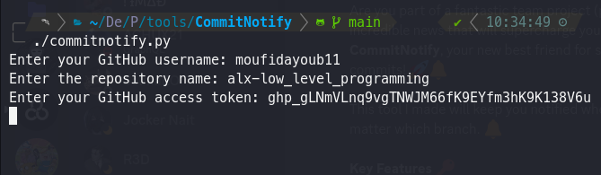
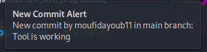
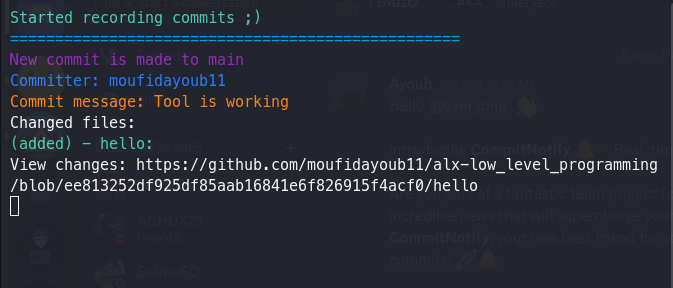

# CommitNotify: Real-time GitHub Commit Notifications

## Table of Contents
1. [Introduction](#introduction)
2. [Features](#features)
3. [Getting Started](#getting-started)
    - [Installation](#installation)
4. [How to Use CommitNotify](#how-to-use-commitnotify)
5. [Global Accessibility](#making-commitnotify-globally-accessible)
6. [Contributions](#contributions)

## Introduction
**CommitNotify** is an exceptional command-line tool meticulously designed to elevate your GitHub development workflow. It's your gateway to real-time GitHub commit notifications, ensuring you're always in sync with your repositories.

## Features

### Stay Informed Instantly
CommitNotify streamlines the process of tracking multiple GitHub repositories. Receive prompt desktop notifications whenever new commits are made, ensuring you never miss a commit made by your team.

### Effortless Setup
We understand the value of your time. CommitNotify boasts a hassle-free setup process, eliminating the need for complex configurations. Within minutes, you'll be up and running.

### Customize the Notifications to Your Liking
CommitNotify allows you to customize notification messages, aligning with your preferences, whether you prefer concise updates or in-depth commit details.

### Collaboration Made Seamless
If you're collaborating with a teammate, CommitNotify acts as your virtual assistant. No more manual checks for your partner's commits; CommitNotify keeps you informed about every new commit in every branch.

## Getting Started
Let's embark on your journey with CommitNotify. Follow these straightforward steps to supercharge your GitHub experience:

### Installation
1. Clone the CommitNotify repository to your local machine:
   ```sh
   git clone https://github.com/moufidayoub11/commitnotify.git
   ```
2. Navigate into the cloned directory:
   ```sh
   cd CommitNotify
   ```

3. Install the required Python libraries using pip:
   ```sh
   pip install plyer requests
   ```

4. Run the tool:
   ```sh
   python commitnotify.py
   ```

## How to Use CommitNotify
CommitNotify is designed with simplicity in mind.
Using CommitNotify is as simple as setting up your credentials and letting it run:

1. **Setup Your Credentials**: Just set up your GitHub credentials like this (my token is revoked after this screenshot :wink:):



2. **Start Listening for Commits**: Click enter, and the code will start listening for commits:


3. **Receive Desktop Notifications**: Once your partner/team makes a commit and pushes to GitHub, you will receive a desktop notification:



4. **View Commit Details**: All the information about the commit, including modified files and the new version, is provided in the terminal:



note: the GitHub username, repository name, and access token should all lead to one repo

## Making CommitNotify Globally Accessible <a name="making-commitnotify-globally-accessible"></a>
To make CommitNotify globally accessible and at your fingertips, follow these steps:

1. **Unix-like Operating Systems (Linux, macOS)**:
   - Make the `commitnotify.py` script executable:
   ```
   chmod +x commitnotify.py
   ```
   - Copy the script into a directory within your system PATH, such as `/usr/local/bin`, and give it a memorable name (e.g., `commitnotify`):
   ```
   sudo cp commitnotify.py /usr/local/bin/commitnotify
   ```

2. **Windows**:
   - Copy the `commitnotify.py` file to a directory of your choice (e.g., `C:\scripts`).
   - Rename it for easy recall (e.g., `commitnotify`).
   - Press the Windows key, search for "Environment Variables," and select "Edit the system environment variables."
   - In the System Properties window, navigate to the "Advanced" tab and click "Environment Variables."
   - Under "System variables," locate the `Path` variable, select it, and click "Edit."
   - In the Edit Environment Variable window, click "New," then "Browse." Navigate to the directory where you copied `commitnotify.py` (e.g., `C:\scripts`), select it, and click "OK."
   - Click "OK" to close all open windows.

Now, you can effortlessly run CommitNotify from anywhere using the `commitnotify` command on Unix-like systems or `commitnotify.py` on Windows. Experience the convenience! 🚀

## Contribution <a name="contributions"></a>

Contributions to **CommitNotify** are welcome! If you find any issues or have suggestions, please open a new issue on the [GitHub repository](https://github.com/moufidayoub11/commitnotify/issues).

We appreciate your support! Happy coding! 🚀
